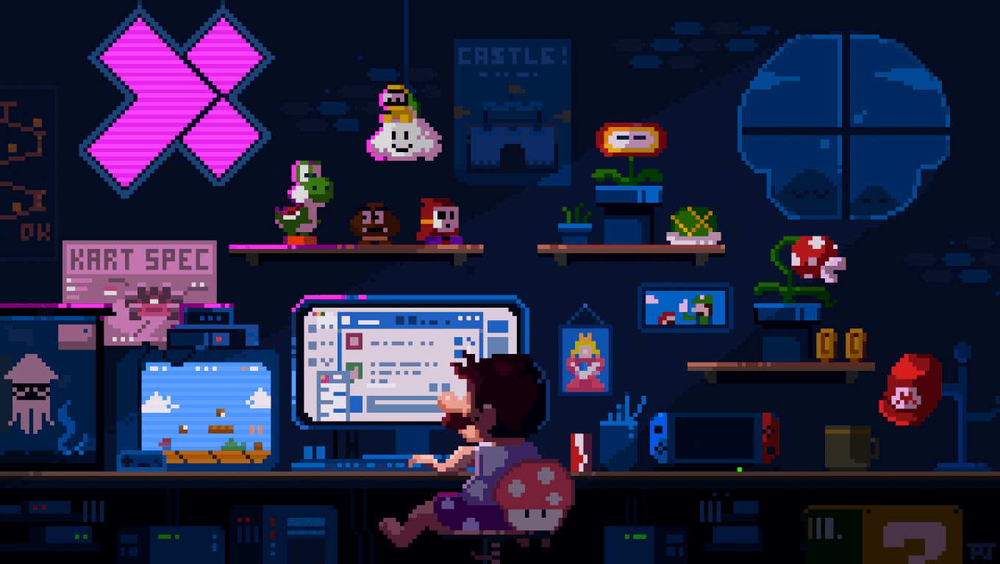

# Upal Barua

**`A developer filled with enthusiasm and passion`**

<!-- 
 
 -->

- 🌱 I’m currently learning **Next.js**

- 👨‍💻 All of my projects are available at [https://upal.vercel.app/](https://upal.vercel.app/)

- 💬 Ask me about **React, Javascript**

- 📫 How to reach me **upalbarua52@gmail.com**

- 📄 Know about my experiences [https://drive.google.com/file/d/1fAZLlu-XvqSaNsEETEspeyUlhd1XvMT6/view](https://drive.google.com/file/d/1fAZLlu-XvqSaNsEETEspeyUlhd1XvMT6/view)

- ⚡ Fun fact **I'm your personal humor curator, dedicated to keeping smiles abundant**

 
 

## 🧰 Languages and Tools

 
 
 
 
 
 

## 📈 GitHub Stats

 
 

## 📕 Latest Blog Posts

<!-- BLOG-POST-LIST:START -->

- [Render ATL 2023 Trip Report](https://dev.to/codestackr/render-atl-2023-trip-report-mp4)
- [Web Development Roadmap 2023](https://dev.to/codestackr/web-development-roadmap-2023-5beo)
- [Getting Started with MongoDB &amp; Mongoose](https://dev.to/codestackr/getting-started-with-mongodb-mongoose-2h6a)
- [How To Pass Application Tracking Systems &lpar;ATS&rpar; &amp; Get Interviews - Resume Tips for Software Developer](https://dev.to/codestackr/how-to-pass-application-tracking-systems-ats-get-interviews-resume-tips-for-software-developer-4bmo)
- [Microinteractions: Password Validation Animation](https://dev.to/codestackr/microinteractions-password-validation-animation-5629)
<!-- BLOG-POST-LIST:END -->

➡️ [more blog posts...](https://codestackr.com)
