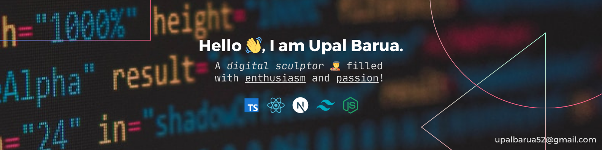

<!-- # Hi there, I'm Upal Barua 👋 -->

<!-- **`🧑‍🎨 A digital sculptor filled with enthusiasm and passion`** -->

### About Me

I'm a dedicated developer passionate about crafting user-friendly web applications. A year ago, I transitioned into development after exploring technology as a hobby for years. _Primarily self-taught, I accelerated my learning with a bootcamp_. I've honed my skills, **specializing in CSS and React within the MERN stack**, and recently ventured into **TypeScript and Next.js**, broadening my expertise. Backend development also intrigues me. Currently, I'm actively <u>seeking a full-time software developer</u> role to gain hands-on experience and collaborate with coding enthusiasts.

<!--   -->

### Tech Stack

 
 
 
 
 

### 📈 GitHub Stats

 
 

 

 

### 📕 Latest Blog Posts

<!-- BLOG-POST-LIST:START -->

- [Dummy Post](#)
<!-- BLOG-POST-LIST:END -->

➡️ [more blog posts...](#)

<!--

- 🌱 I’m currently learning **Next.js**

- 👨‍💻 All of my projects are available at [https://upal.vercel.app/](https://upal.vercel.app/)

- 💬 Ask me about **React, Javascript**

- 📫 How to reach me **upalbarua52@gmail.com**

- 📄 Know about my experiences [https://drive.google.com/file/d/1fAZLlu-XvqSaNsEETEspeyUlhd1XvMT6/view](https://drive.google.com/file/d/1fAZLlu-XvqSaNsEETEspeyUlhd1XvMT6/view)

- ⚡ Fun fact **I'm your personal humor curator, dedicated to keeping smiles abundant** -->
