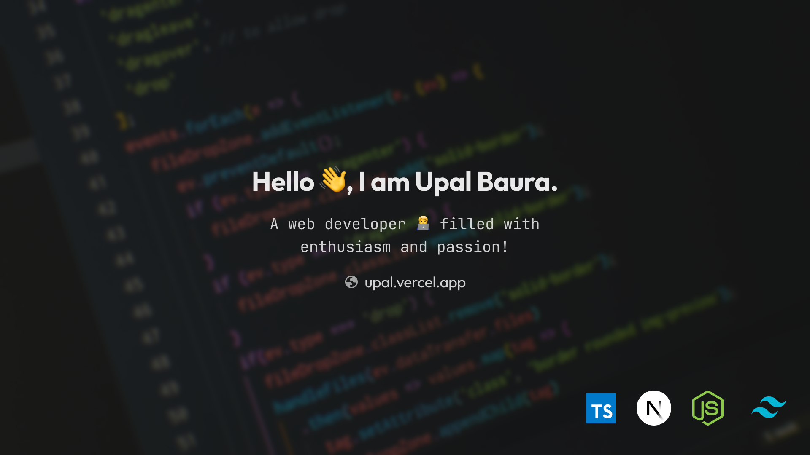

## 💁 About Me

I'm a dedicated developer passionate about crafting user-friendly web applications. A year ago, I transitioned into development after exploring technology as a hobby for years. _Primarily self-taught, I accelerated my learning with a bootcamp_. I've honed my skills, **specializing in CSS and React within the MERN stack**, and recently ventured into **TypeScript and Next.js**, broadening my expertise. Backend development also intrigues me. Currently, I'm actively <u>seeking a full-time software developer</u> role to gain hands-on experience and collaborate with coding enthusiasts.

 

 

## 🧰 Tech Stack

  
  
  
  
  
  
  
  
  
  
  
  
  
  
  
  
  
  
  
  
  

 

## 📈 GitHub Stats

 

 

## 📬 Contact Me

 

## 📕 Latest Blog Posts

`coming soon...`
